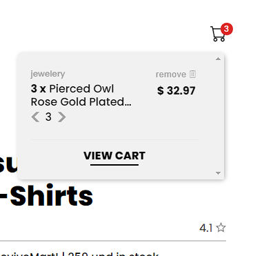

# Revive Mart

Revive Mart is an e-commerce platform built with React.js & Styled Components.

  

## About Project

I chose to consume the <a href="https://fakestoreapi.com/">Fake Store API</a> to display all the products from the store; they are categorized into Jewelry, Women's, and Men's categories. 

  

### Filter Products
If the user wants a customized product view based on the available filters, they can filter by: Lowest price, Highest price, Name (A - Z), or Rating (Stars).

  

### Info for each product
Each product has a display where the user can add the item to the cart, view its price, and access more information about it.

  

### Cart 
If the user wants to see the status of their cart, they will have a small visual feedback indicating the quantity of items they have added to the cart. They will also have a dropdown with more information about the selected products, where they can add more items if necessary, remove items, and view the total for each product based on the chosen quantity. If there are no items, it will show that the cart is empty.

  

### Cart Resume
There is a cart summary page where the user can access and view more information about the products in the cart and proceed to checkout.

  

## Built With

- React.js
- Styled Components
- Vite
- React Router Dom
